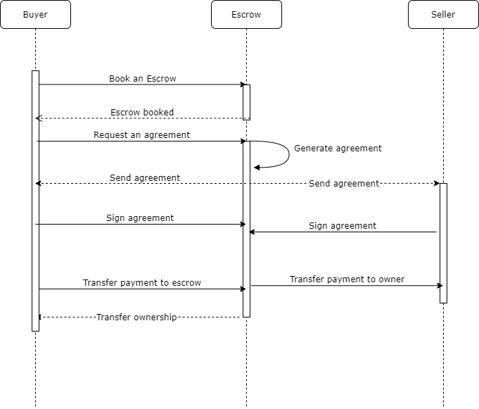

# property-exchange: a real-estate application powered by Ethereum blockchain

<br>

## Author: Saketh Varma, Pericherla

<br>

## Demo:

<a href="https://drive.google.com/drive/folders/1vJEWUXqvdSWCK8MYuTArPsKDJ1ccbjnj?usp=sharing">https://drive.google.com/drive/folders/1vJEWUXqvdSWCK8MYuTArPsKDJ1ccbjnj?usp=sharing</a>

## Introduction:

- Property exchange is a unified online marketplace for buying and selling properties. All the steps involved in the sale are made completely transparent and verifiable by leveraging the Ethereum Blockchain.

- Each property is represented as a single non-fungible token(NFT) using the ERC721 Standard.

- A typical interaction in the application can involve a combination of users of type buyer, escrow and seller buying, selling and authorizing property sales.

<br>

## Application Flow:

- Once the buyer chooses a property to buy from the provided listings, the buyer requests an escrow officer to foresee the sale.
- Once the escrow officer is onboard, he/she generates an agreement which specifies the terms and conditions pertaining to the sale of the property.
- The agreement will be reviewed and signed by both the buyer and the seller.
- The buyer then transfers the deposit amount to the escrow.
- On receiving the amount, the escrow transfers the amount to the seller and the transfer of property is completed.
- Ethereum blockchain is used to record the signatures on the agreement and all the transactions involved in transferring the property.
- A back-end server powered by Node.js and PostgreSQL to store and retrieve records and metadata instead of hitting the blockchain for retrieval. This pattern has been carefully used so that transactions and records are stored on the blockchain and the back-end server is only needed for faster retrievals. From a business perspective, in the event of a loss of data or conflict in information, event logs and background jobs can be used to rebuild the backend database / records.

<br>
<br>
<br>

## Installation instructions:

### The application:

```bash

$ git clone https://github.com/socket-var/px-bootcamp.git
$ cd client
$ npm install
$ cd server
$ npm install
```

- Note that this application needs the latest version of Node.js and PostgreSQL binaries for storing and retrieving historic data obtained from the application interacting with the blockchain.
- I recommend watching the video completely if you do not want to install and configure postgreSQL which is not straightforward.
- Change the "from" address in "2_deploy_contracts.js" to your account of choice before running truffle migrate.
- Make sure the port on which ganache is running is correct in truffle-config.js, if you are using ganche GUI it should run on 7545.
- If you want to test with rinkeby, make sure you have .mneumonic and .infura-secret files in the project root directory.

### Local blockchain using Ganache:

```bash
$ cd px-bootcamp
$ npm install
$ cd ..
$ truffle migrate --reset
```

### Solidity tests:

- 12 tests written in JavaScript that start off testing various functions from register() to transferProperty() and end with tests like checking if excess amount is refunded and other edge cases.
- Before running tests, change the "from" address in "2_deploy_contracts.js" to your account of choice.
- Make sure the port on which ganache is running is correct in truffle-config.js, if you are using ganche GUI it should run on 7545.
- If you want to test with rinkeby, make sure you have .mneumonic and .infura-secret files in the project root directory.

```bash
$ truffle test
```

### Running the app:

```bash
$ cd px-bootcamp
$ cd server
$ npm start dev
```

## Sequence diagram:



## Smart contract:

- An NFT represented by a single real-estate property is called a PxCoin (PxC).
- We use OpenZeppelin's ERC721 implementation to represent the PxC.
- PropertyExchange.sol defines application specific methods while PxCoinFactory.sol is a factory that mints tokens.

## The application:

The platform is a full stack javascript application powered by the following technologies:

- Front-end: React.js with Redux and react-strap
- Database: PostgreSQL
- Server: Express.js
- Blockchain API: web3.js
- Ethereum wallet: Metamask

## Project requirements:

- [x] A README.md that explains the project
  - [x] What does it do?
  - [x] How to set it up.
    - [x] How to run a local development server.
- [x] It should be a [Truffle project](https://truffleframework.com/docs/truffle/getting-started/creating-a-project).
  - [x] All contracts should be in a `contracts` directory.
    - [x] `truffle compile` should successfully compile contracts.
  - [x] Migration contract and migration scripts should work.
    - [x] `truffle migrate` should successfully migrate contracts to a locally running `ganache-cli` test blockchain on port `8454`.
  - [x] All tests should be in a `tests` directory.
    - [x] `truffle test` should migrate contracts and run the tests.
- [x] Smart contract code should be commented according to the [specs in the documentation](https://solidity.readthedocs.io/en/v0.5.2/layout-of-source-files.html#comments).
- [x] Create at least 5 tests for each smart contract.
  - [x] Write a sentence or two explaining what the tests are covering, and explain why those tests were written.
- [x] A development server to serve the front-end interface of the application.
- [x] A document [design_pattern_decisions.md](design_pattern_decisions.md) that explains the design patterns chosen.
- [x] A document [avoiding_common_attacks.md](avoiding_common_attacks.md) that explains what measures were taken to ensure that the contracts are not susceptible to common attacks.
- [x] Implement/use a library or an EthPM package.
